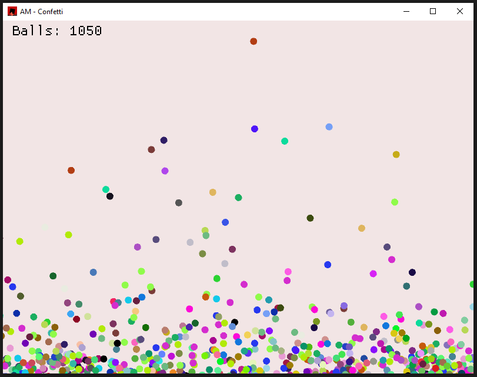

# Confetti

**Confetti** is a simple simulation written in Rust using the [macroquad](https://macroquad.rs/) library. It showcases the behavior of falling balls that collide with each other and the screen boundaries. This project demonstrates basic physics simulations, collision detection, and visual rendering.



## Features
- **Real-time physics**: Gravity, drag, and floor collision with energy loss.
- **Collision detection**: Balls interact dynamically, reflecting off each other with simple physics.
- **User interaction**: Click to spawn new balls at the mouse position.
- **Dynamic rendering**: Smooth animations using the `macroquad` game loop.

## Controls
- **Left Mouse Button**: Spawn a ball at the mouse position per frame.
- **Right Mouse Button**: Spawn a single ball at the mouse position.

## Requirements
- **Rust**: Ensure you have the latest version of Rust installed. You can install it from [rust-lang.org](https://www.rust-lang.org/).
- **macroquad**: The project relies on the `macroquad` crate, which is automatically resolved during compilation.

## Installation and Running
1. Clone the repository:
   ```bash
   git clone https://github.com/Andrew-McCall/MacroquadConfetti.git
   cd MacroquadConfetti
   cargo run --release
    ```

## Customization
You can adjust the following constants in the code to tweak the simulation:

- **Gravity (GRAVITY)**: Adjust the downward force on the balls.
- **Ball Radius (BALL_RADIUS)**: Modify the size of the balls.
- **Energy Loss on Collision (FLOOR_LOSS)**: Control energy retention on collisions.

## License
MIT - Go wild.